# 🍳🔥 Kitchen Safety Monitoring System

<p align="center">

### 🛡️ Arduino-Based Smart Kitchen Safety System

**Gas Leak Detection • Fire Detection • Temperature Monitoring • Automatic Fan • Buzzer Alert**

<br>


</p>

---

# 🚨 Project Overview

This project is an **Arduino-based Kitchen Safety Monitoring System** designed to continuously monitor:

* 💨 Gas leakage
* 🔥 Fire/flame conditions
* 🌡️ Temperature

When a dangerous condition is detected, the system automatically activates the appropriate safety devices:

* 🔴 Red LED → Warning
* 🟢 Green LED → Safe condition
* 🔊 Buzzer → Alarm
* 🌀 Fan → Ventilation
* 📟 16×2 LCD → Displays system status

---

# ✨ System Animation

The complete working process can be visualized like this:

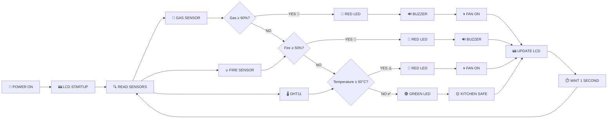

> 🔄 **The system continuously repeats this monitoring cycle.**

---

# 🎬 Sensor Monitoring Animation

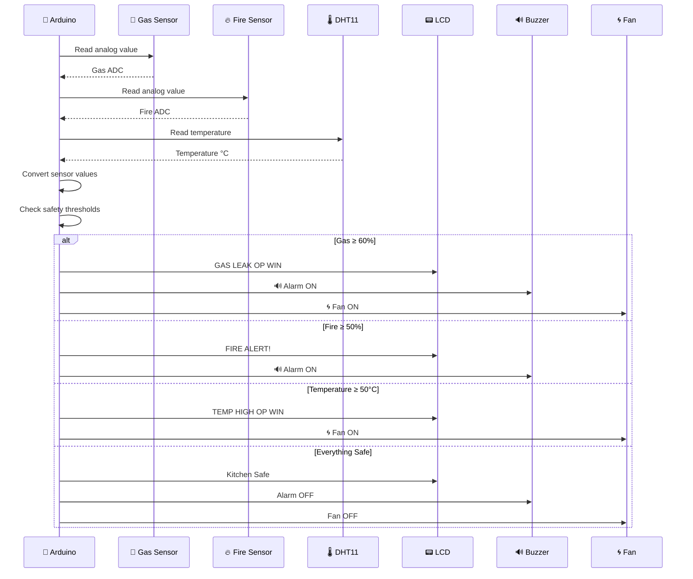

---

# 🧠 How The Program Works

The Arduino performs four major operations:

```text
┌──────────────────────────────────────────────┐
│              🍳 KITCHEN MONITOR              │
├──────────────────────────────────────────────┤
│                                              │
│   💨 GAS SENSOR ───────┐                    │
│                        │                    │
│   🔥 FIRE SENSOR ──────┼──► 🤖 ARDUINO      │
│                        │                    │
│   🌡️ DHT11 ────────────┘                    │
│                                              │
│                 │                            │
│                 ▼                            │
│          🧠 DECISION LOGIC                  │
│                 │                            │
│       ┌─────────┼─────────┐                 │
│       ▼         ▼         ▼                 │
│     🔊 ALARM   🌀 FAN    💡 LED             │
│                                              │
│                 │                            │
│                 ▼                            │
│             📟 LCD DISPLAY                  │
│                                              │
└──────────────────────────────────────────────┘
```

---

# 🔌 Pin Configuration

| Component      | Arduino Pin | Purpose         |
| -------------- | ----------: | --------------- |
| 📟 LCD RS      |         D13 | Register Select |
| 📟 LCD EN      |         D12 | Enable          |
| 📟 LCD D4      |         D11 | LCD Data        |
| 📟 LCD D5      |         D10 | LCD Data        |
| 📟 LCD D6      |          D9 | LCD Data        |
| 📟 LCD D7      |          D8 | LCD Data        |
| 💨 Gas Sensor  |          A0 | Gas level       |
| 🔥 Fire Sensor |          A1 | Fire level      |
| 🌡️ DHT11      |          D3 | Temperature     |
| 🔴 Red LED     |          D6 | Warning         |
| 🟢 Green LED   |          D5 | Safe            |
| 🔊 Buzzer      |          D2 | Alarm           |
| 🌀 Fan         |          D4 | Ventilation     |

---

# 📊 Sensor Data Flow

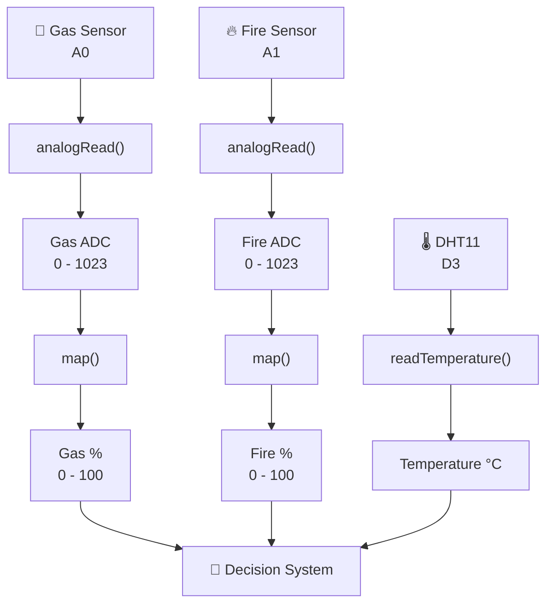

---

# 💨 Gas Leak Detection

The gas sensor is connected to **A0**.

The program reads the analog value:

```cpp
int gasADC = analogRead(GAS_SENSOR);
```

Then converts it to a percentage:

```cpp
int GAS = map(gasADC, 0, 1023, 0, 100);
```

### 🚨 Gas Decision

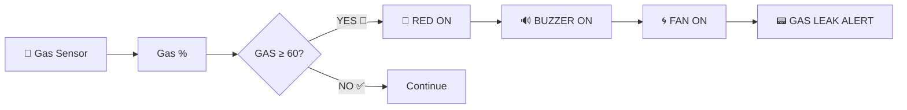

### Gas Threshold

```text
Gas Level

0% ─────────────── 59% ─── 60% ─────────── 100%
🟢 SAFE                    🚨 DANGER
                            ▲
                            │
                       ALERT STARTS
```

---

# 🔥 Fire Detection

The fire sensor is connected to **A1**.

```cpp
int fireADC = analogRead(FIRE);
```

The value is converted to a percentage:

```cpp
int fire = map(fireADC, 0, 1023, 0, 100);
```

If the fire level reaches **50% or more**, the system enters fire-alert mode.

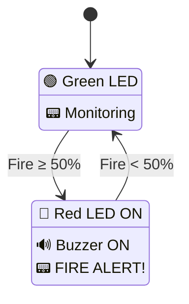

---

# 🌡️ Temperature Monitoring

The DHT11 is connected to **D3**.

```cpp
int temperature = dht11.readTemperature();
```

The temperature threshold is:

```cpp
temperature >= 50
```

### Temperature Animation

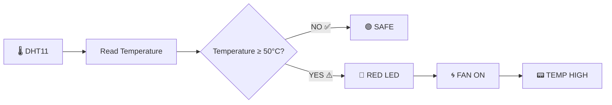

---

# 🚦 Complete Decision Priority

The program checks conditions in this exact order:

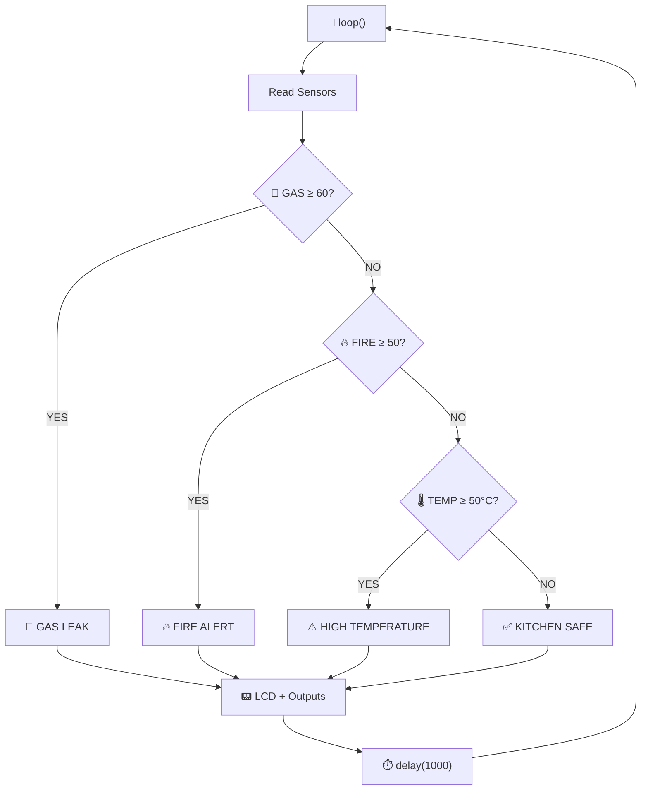

### ⚠️ Important

Because the conditions use:

```cpp
if
else if
else if
else
```

only **one condition is selected per loop**.

The priority is:

```text
🥇 GAS LEAK
     ↓
🥈 FIRE
     ↓
🥉 HIGH TEMPERATURE
     ↓
🏅 SAFE
```

So if both gas and fire are detected, the **gas-leak branch executes first**.

---

# 💡 LED Status Animation

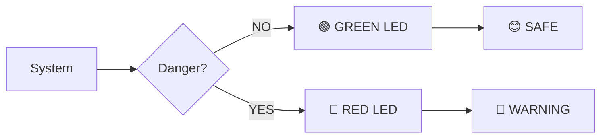

| Condition        | 🔴 Red | 🟢 Green |
| ---------------- | ------ | -------- |
| Safe             | OFF    | ON       |
| Gas Leak         | ON     | OFF      |
| Fire             | ON     | OFF      |
| High Temperature | ON     | OFF      |

---

# 🔊 Buzzer Logic

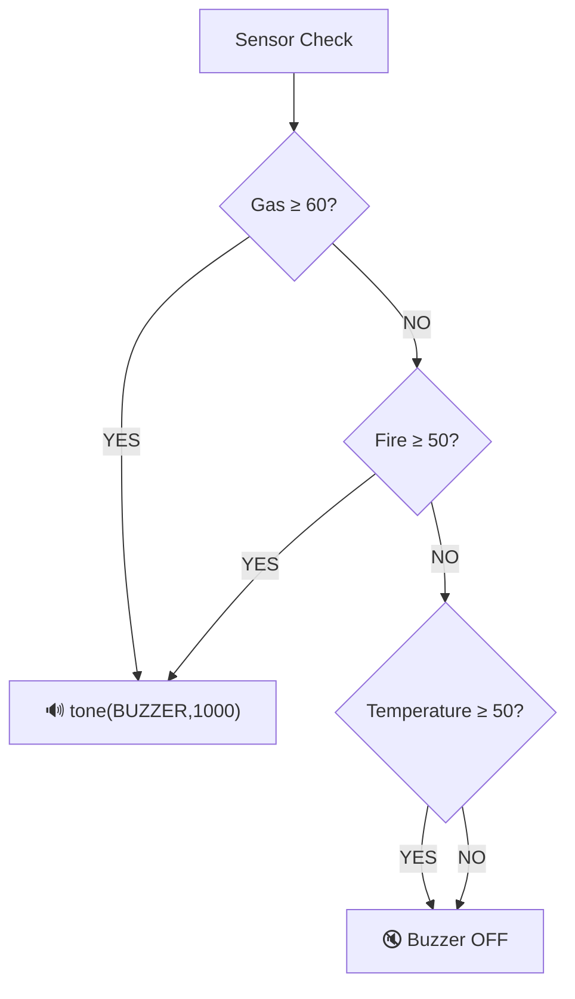

### Alarm Frequency

```cpp
tone(BUZZER,1000);
```

This generates a **1000 Hz tone** on the buzzer.

---

# 🌀 Automatic Fan Control

The fan provides ventilation during dangerous gas or high-temperature conditions.

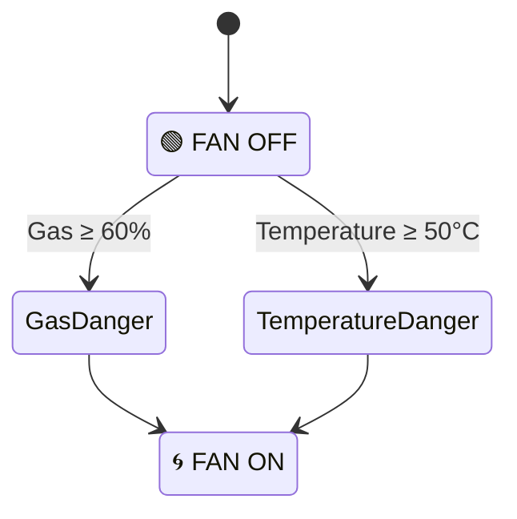

---

# 📟 LCD Display Animation

## Startup

When the Arduino starts:

```text
┌────────────────┐
│Kitchen Monitor │
│  System        │
└────────────────┘
        ↓
      2 sec
        ↓
┌────────────────┐
│                │
│   Monitoring   │
└────────────────┘
```

---

## Normal Mode

```text
┌────────────────┐
│ Kitchen Safe   │
│ G:25 F:10 T:32°C│
└────────────────┘
```

---

## Gas Leak

```text
┌────────────────┐
│GAS LEAK OP WIN │
│G:75     T:45   │
└────────────────┘

      🚨
      ↓
   🔴 RED
   🔊 BUZZER
   🌀 FAN
```

---

## Fire Alert

```text
┌────────────────┐
│ FIRE ALERT!    │
│ F:72     T:41  │
└────────────────┘

      🔥
      ↓
   🔴 RED
   🔊 BUZZER
```

---

## High Temperature

```text
┌────────────────┐
│TEMP HIGH OP WIN│
│T:55°C          │
└────────────────┘

      🌡️
      ↓
   🔴 RED
   🌀 FAN
```

---

# 🔄 Main Loop Animation

Every approximately **1 second**, the Arduino repeats:

```text
        ┌───────────────┐
        │   🔄 START    │
        └───────┬───────┘
                ↓
        ┌───────────────┐
        │ Read DHT11    │
        │ 🌡️ Temperature│
        └───────┬───────┘
                ↓
        ┌───────────────┐
        │ Read Gas A0   │
        │ 💨            │
        └───────┬───────┘
                ↓
        ┌───────────────┐
        │ Read Fire A1  │
        │ 🔥            │
        └───────┬───────┘
                ↓
        ┌───────────────┐
        │ 🧠 DECISION   │
        └───────┬───────┘
                ↓
       ┌────────┼────────┐
       ↓        ↓        ↓
     💨 GAS   🔥 FIRE   🌡️ TEMP
       │        │        │
       └────────┼────────┘
                ↓
        ┌───────────────┐
        │ 📟 LCD UPDATE │
        └───────┬───────┘
                ↓
        ┌───────────────┐
        │ ⏱️ 1 SECOND   │
        └───────┬───────┘
                │
                └──────────────► 🔄 REPEAT
```

---

# 🧩 Code Structure

The program can be divided into these sections:

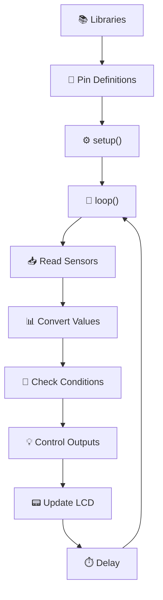

---

# 📚 Libraries

The project uses:

```cpp
#include <LiquidCrystal.h>
#include <DHT11.h>
```

### `LiquidCrystal`

Controls the **16×2 LCD display**.

### `DHT11`

Reads temperature from the **DHT11 temperature sensor**.

---

# ⚙️ Setup Function

The `setup()` function runs **once** when the Arduino starts.

It:

1. Starts the LCD.
2. Configures sensor pins.
3. Configures LED, buzzer and fan pins.
4. Displays the startup message.
5. Waits for 2 seconds.
6. Clears the LCD.

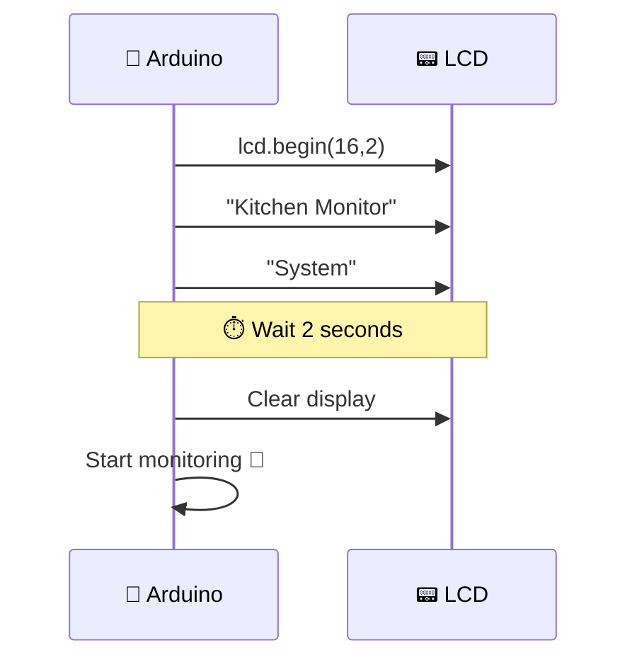

---

# 🔄 Loop Function

The `loop()` function runs continuously.

```cpp
void loop()
{
    // Read sensors

    // Convert sensor values

    // Check danger conditions

    // Control outputs

    // Display status

    // Wait 1 second
}
```

The loop is the **heart of the project** ❤️.

---

# 🧠 Decision Table

|  Gas | Fire | Temperature | Result               |
| ---: | ---: | ----------: | -------------------- |
| < 60 | < 50 |      < 50°C | 🟢 Safe              |
| ≥ 60 |  Any |         Any | 🚨 Gas Leak          |
| < 60 | ≥ 50 |         Any | 🔥 Fire Alert        |
| < 60 | < 50 |      ≥ 50°C | 🌡️ High Temperature |

> **Gas has the highest priority**, followed by fire, then temperature.

---

# 🛠️ Hardware Required

* 🤖 Arduino UNO
* 📟 16×2 LCD
* 💨 Gas sensor
* 🔥 Fire/flame sensor
* 🌡️ DHT11 sensor
* 🔴 Red LED
* 🟢 Green LED
* 🔊 Buzzer
* 🌀 DC Fan
* ⚡ Resistors
* 🔌 Jumper wires
* 🧪 Breadboard
* 🔋 Power supply

---

# 🔗 Hardware Architecture

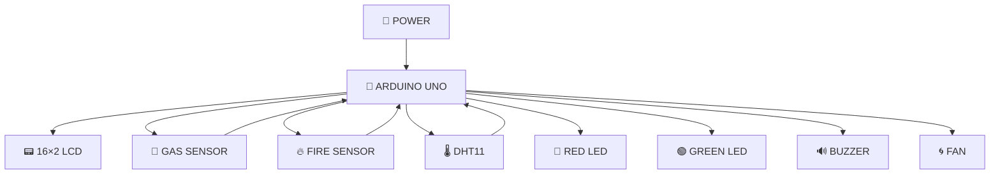

---

# 🚨 Alert State Animation

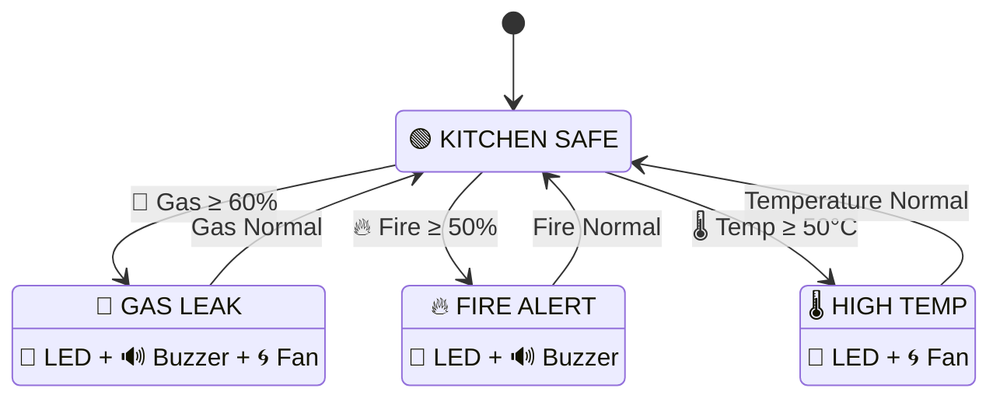

---

# 📈 Monitoring Pipeline

```text
             SENSOR WORLD
                  │
       ┌──────────┼──────────┐
       ↓          ↓          ↓
     💨 Gas     🔥 Fire    🌡️ Temp
       │          │          │
       └──────────┼──────────┘
                  ↓
             🤖 ARDUINO
                  │
                  ↓
            🧠 PROCESSING
                  │
          ┌───────┼───────┐
          ↓       ↓       ↓
        🚨      ⚠️       ✅
       Danger   Warning   Safe
          │       │       │
          ↓       ↓       ↓
        🔴🔊🌀   🔴🌀     🟢
          │       │       │
          └───────┼───────┘
                  ↓
              📟 LCD
```

---

# 🎯 Threshold Visualization

```text
💨 GAS
0% ─────────────────────── 100%
🟢🟢🟢🟢🟢🟢🟢🟢🟢🔴🔴🔴
                    ▲
                  60% 🚨


🔥 FIRE
0% ─────────────────────── 100%
🟢🟢🟢🟢🟢🔴🔴🔴🔴🔴🔴🔴
              ▲
             50% 🚨


🌡️ TEMPERATURE
0°C ─────────────────────── 100°C
🟢🟢🟢🟢🟢🟢🟢🟢🟢🔴🔴🔴
                    ▲
                  50°C ⚠️
```

---

# 💻 Complete Arduino Code

```cpp
#include <LiquidCrystal.h>
#include <DHT11.h>

const int rs = 13, en = 12, d4 = 11, d5 = 10, d6 = 9, d7 = 8;
LiquidCrystal lcd(rs, en, d4, d5, d6, d7);

const int GAS_SENSOR = A0;
const int FIRE = A1;
const int RED = 6;
const int GREEN = 5;
const int BUZZER = 2;
const int FAN = 4;

DHT11 dht11(3);

void setup()
{
  lcd.begin(16,2);

  pinMode(GAS_SENSOR, INPUT);
  pinMode(FIRE, INPUT);
  pinMode(RED, OUTPUT);
  pinMode(GREEN, OUTPUT);
  pinMode(BUZZER, OUTPUT);
  pinMode(FAN, OUTPUT);

  lcd.setCursor(0,0);
  lcd.print("Kitchen Monitor");

  lcd.setCursor(2,1);
  lcd.print("System");

  delay(2000);
  lcd.clear();
}

void loop()
{
  int temperature = dht11.readTemperature();

  int gasADC = analogRead(GAS_SENSOR);
  int fireADC = analogRead(FIRE);

  int GAS = map(gasADC, 0, 1023, 0, 100);
  int fire = map(fireADC, 0, 1023, 0, 100);

  lcd.clear();

  if (GAS >= 60)
  {
    digitalWrite(RED, HIGH);
    digitalWrite(GREEN, LOW);
    digitalWrite(FAN, HIGH);

    tone(BUZZER,1000);

    lcd.setCursor(0,0);
    lcd.print("GAS LEAK OP WIN");

    lcd.setCursor(0,1);
    lcd.print("G:");
    lcd.print(GAS);

    lcd.setCursor(8,1);
    lcd.print("T:");
    lcd.print(temperature);
  }

  else if (fire >= 50)
  {
    digitalWrite(RED,HIGH);
    digitalWrite(GREEN,LOW);

    tone(BUZZER,1000);

    lcd.setCursor(0,0);
    lcd.print("FIRE ALERT!");

    lcd.setCursor(0,1);
    lcd.print("F:");
    lcd.print(fire);

    lcd.setCursor(8,1);
    lcd.print("T:");
    lcd.print(temperature);
  }

  else if (temperature >= 50)
  {
    digitalWrite(RED,HIGH);
    digitalWrite(GREEN,LOW);
    digitalWrite(FAN,HIGH);

    noTone(BUZZER);

    lcd.setCursor(0,0);
    lcd.print("TEMP HIGH OP WIN");

    lcd.setCursor(0,1);
    lcd.print("T:");
    lcd.print(temperature);
    lcd.print((char)223);
    lcd.print("C");
  }

  else
  {
    digitalWrite(RED,LOW);
    digitalWrite(GREEN,HIGH);
    digitalWrite(FAN,LOW);

    noTone(BUZZER);

    lcd.setCursor(0,0);
    lcd.print("Kitchen Safe");

    lcd.setCursor(0,1);
    lcd.print("G:");
    lcd.print(GAS);

    lcd.setCursor(6,1);
    lcd.print("F:");
    lcd.print(fire);

    lcd.setCursor(11,1);
    lcd.print("T:");
    lcd.print(temperature);
    lcd.print((char)223);
    lcd.print("C");
  }

  delay(1000);
}
```

---

# ⚠️ Important Code Note

There is one small behavior to be aware of in the current code.

In the **fire alert** section, the fan is not explicitly turned OFF:

```cpp
else if (fire >= 50)
{
    digitalWrite(RED,HIGH);
    digitalWrite(GREEN,LOW);
    tone(BUZZER,1000);
}
```

If the previous loop had a gas alert, the fan may remain ON because the Arduino output stays in its previous state.

A safer version would explicitly control the fan in every condition:

```cpp
else if (fire >= 50)
{
    digitalWrite(RED,HIGH);
    digitalWrite(GREEN,LOW);
    digitalWrite(FAN,LOW);

    tone(BUZZER,1000);

    // LCD...
}
```

Whether the fan should be ON during a fire depends on the physical design and ventilation strategy; for a real kitchen safety system, **do not rely on this prototype as a certified fire/gas safety device**.

---

# 🚀 Future Improvements

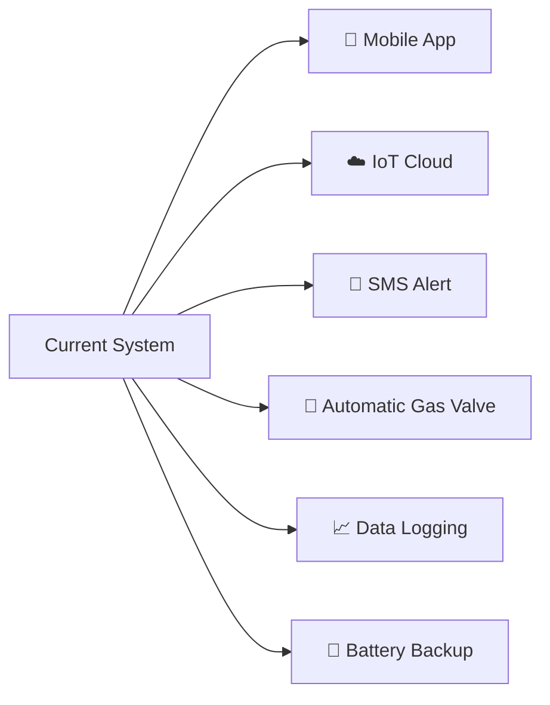

Possible improvements:

* 📱 Add Bluetooth/mobile monitoring
* 🌐 Add Wi-Fi/IoT connectivity
* 📲 Send SMS alerts
* 📊 Store sensor readings
* 🚪 Automatically shut a gas valve
* 🔋 Add backup battery
* 🔔 Add different alarm patterns
* 📟 Add scrolling LCD messages
* 📈 Add real-time graphs
* 🧠 Add sensor calibration
* 🔄 Add averaging/filtering for noisy sensor readings

---

# 🏆 Project Concept

```text
        ┌───────────────────────────┐
        │     🍳 SMART KITCHEN      │
        │        MONITOR             │
        └─────────────┬─────────────┘
                      │
          ┌───────────┼───────────┐
          ↓           ↓           ↓
        💨 GAS      🔥 FIRE     🌡️ TEMP
          │           │           │
          └───────────┼───────────┘
                      ↓
                🤖 ARDUINO UNO
                      │
                🧠 DECISION
                      │
          ┌───────────┼───────────┐
          ↓           ↓           ↓
        🔴 LED      🔊 ALARM     🌀 FAN
                      │
                      ↓
                  📟 LCD
                      │
                      ↓
                🛡️ SAFETY
```

---

# ⭐ Final Working Animation

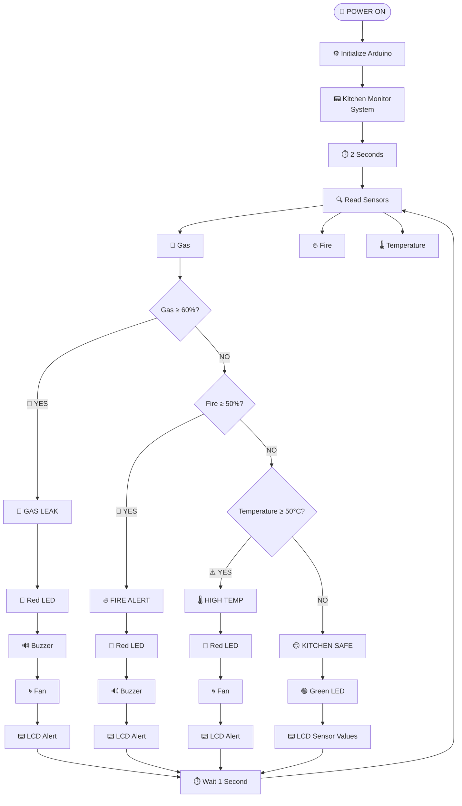

---

# 👨‍💻 Project Summary

**Kitchen Safety Monitoring System** is a simple embedded safety project demonstrating how an Arduino can combine multiple sensors and output devices into a real-time monitoring system.

### 🔍 Inputs

**Gas + Fire + Temperature**

### 🧠 Processing

**Arduino UNO**

### 📢 Outputs

**LCD + LEDs + Buzzer + Fan**

### 🔄 Operation

**Continuous real-time monitoring**

---

<p align="center">

## 🍳💨🔥🌡️ → 🤖 → 🧠 → 🚨🛡️

### **Monitor • Detect • Alert • Protect**

</p>

---

<p align="center">

⭐ **If you like this project, consider giving the repository a star!** ⭐

</p>
