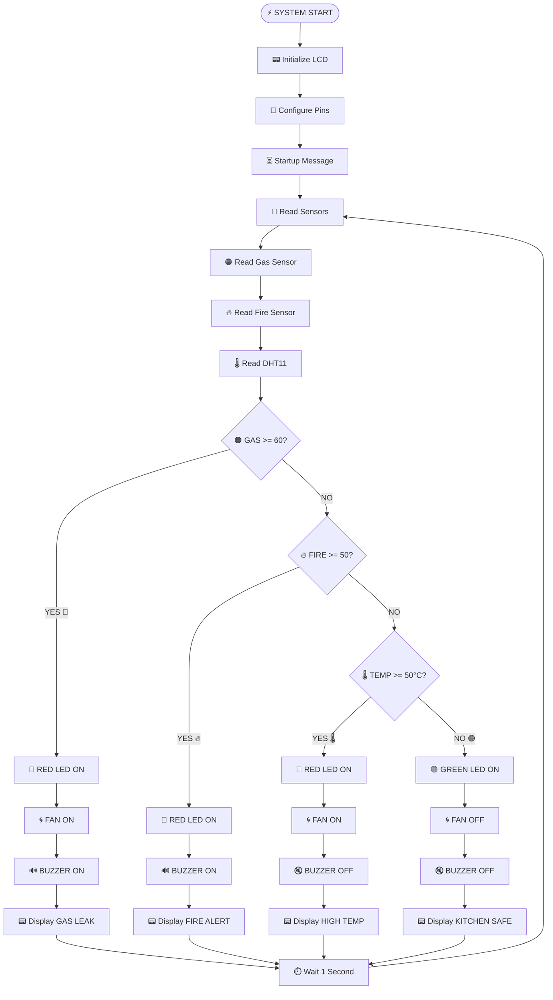
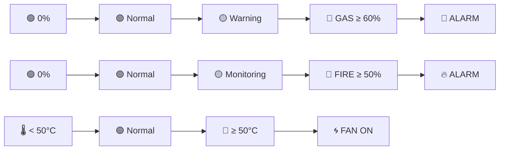
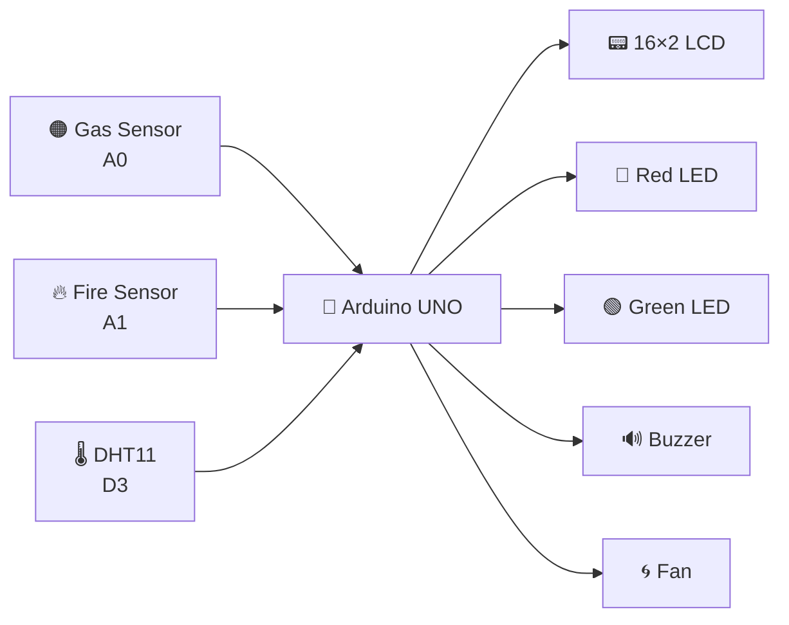
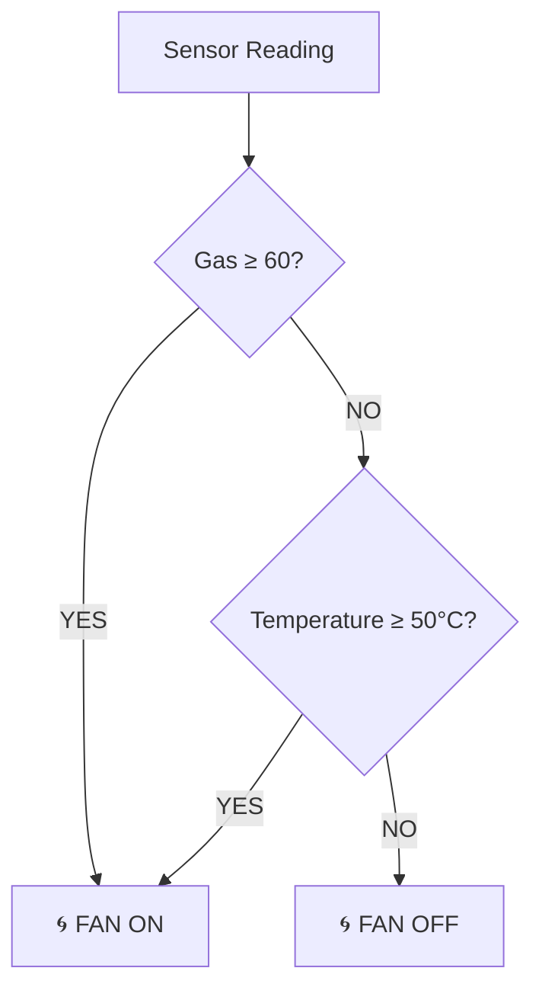
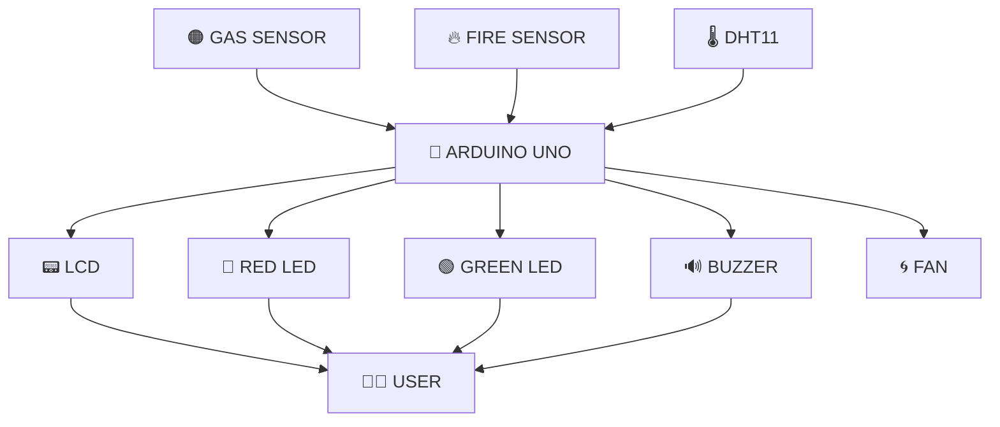

# 🔥 Smart Kitchen Safety Monitoring System

> 🚨 **An Arduino-based kitchen safety system that detects gas leakage, fire, and high temperature — then automatically alerts the user and activates the exhaust fan when required.**


---

## 🎬 Project Overview

This project continuously monitors a kitchen using:

* 🟠 **Gas Sensor** — detects possible gas leakage
* 🔥 **Fire Sensor** — detects fire/flame conditions
* 🌡️ **DHT11** — measures temperature
* 📟 **16×2 LCD** — displays the current safety status
* 🔴 **Red LED** — indicates danger
* 🟢 **Green LED** — indicates safe conditions
* 🔊 **Buzzer** — provides an audible alarm
* 🌀 **Fan** — automatically turns ON during gas leakage or high temperature

### ✨ Basic Operation

```text
             ┌─────────────────────┐
             │     POWER ON ⚡      │
             └──────────┬──────────┘
                        │
                        ▼
             ┌─────────────────────┐
             │  Read All Sensors   │
             │ 🌡️  🔥  🟠          │
             └──────────┬──────────┘
                        │
                        ▼
                ┌───────────────┐
                │  Gas ≥ 60 ?   │
                └───────┬───────┘
                    YES │   │ NO
                        │   ▼
                        │ ┌───────────────┐
                        │ │  Fire ≥ 50 ?  │
                        │ └───────┬───────┘
                        │     YES │   │ NO
                        │         │   ▼
                        │         │ ┌────────────────┐
                        │         │ │ Temp ≥ 50°C ?  │
                        │         │ └───────┬────────┘
                        │         │     YES │   │ NO
                        ▼         ▼         ▼   ▼
                     🚨 GAS     🔥 FIRE   🌡️ HIGH  🟢 SAFE
                        │         │         │       │
                        └────┬────┴────┬────┴───────┘
                             │         │
                             ▼         ▼
                         LCD STATUS  OUTPUT CONTROL
```

---

# 🧠 How the System Works

The Arduino reads the three sensors every **1 second**.

The decision priority is:

```text
🥇 GAS LEAK
       ↓
🥈 FIRE
       ↓
🥉 HIGH TEMPERATURE
       ↓
🟢 SAFE
```

This means if multiple dangerous conditions occur simultaneously, **gas leakage gets the highest priority**.

---

# 🔄 Animated Decision Flow

The following Mermaid diagram shows the complete decision process.



---

# 🎯 Sensor Threshold Animation



---

# 📊 System States

| Condition       | Red LED 🔴 | Green LED 🟢 | Buzzer 🔊 | Fan 🌀 | LCD          |
| --------------- | ---------: | -----------: | --------: | -----: | ------------ |
| 🟢 Safe         |        OFF |           ON |       OFF |    OFF | Kitchen Safe |
| 🚨 Gas ≥ 60     |         ON |          OFF |        ON |     ON | GAS LEAK     |
| 🔥 Fire ≥ 50    |         ON |          OFF |        ON |   OFF* | FIRE ALERT   |
| 🌡️ Temp ≥ 50°C |         ON |          OFF |       OFF |     ON | TEMP HIGH    |

> **Note:** In the current code, the fan is explicitly turned ON for gas leakage and high temperature. During the fire-alert branch, the fan is not changed, so it retains its previous state.

---

# 🧩 Hardware Architecture



---

# 🔌 Pin Configuration

| Component      | Arduino Pin |
| -------------- | ----------- |
| 🟠 Gas Sensor  | A0          |
| 🔥 Fire Sensor | A1          |
| 🌡️ DHT11      | D3          |
| 🔴 Red LED     | D6          |
| 🟢 Green LED   | D5          |
| 🔊 Buzzer      | D2          |
| 🌀 Fan         | D4          |
| 📟 LCD RS      | D13         |
| 📟 LCD EN      | D12         |
| 📟 LCD D4      | D11         |
| 📟 LCD D5      | D10         |
| 📟 LCD D6      | D9          |
| 📟 LCD D7      | D8          |

---

# 🧮 Gas Sensor Conversion

The analog gas sensor produces a value between:

```text
0 ─────────────────────────────── 1023
              ↓
        Arduino ADC value
```

The code converts this into a percentage-like value:

```cpp
int GAS = map(gasADC, 0, 1023, 0, 100);
```

So:

```text
ADC 0     → 0%
ADC 512   → ~50%
ADC 1023  → 100%
```

The alarm threshold is:

```cpp
if (GAS >= 60)
```

Therefore:

```text
       GAS LEVEL

0% ─────────────── 59% ┃ 60% ───────── 100%
🟢 SAFE                 ┃ 🔴 DANGER
                        ↑
                   Alarm starts
```

---

# 🔥 Fire Detection

The fire sensor is also converted into a 0–100 range:

```cpp
int fire = map(fireADC, 0, 1023, 0, 100);
```

The fire alarm condition is:

```cpp
else if (fire >= 50)
```

Therefore:

```text
0% ───────────────── 49% ┃ 50% ───────── 100%
🟢 NORMAL                ┃ 🔥 FIRE ALERT
                         ↑
                    Alarm starts
```

---

# 🌡️ Temperature Detection

The DHT11 temperature is read using:

```cpp
int temperature = dht11.readTemperature();
```

The high-temperature threshold is:

```cpp
else if (temperature >= 50)
```

Visual representation:

```text
🌡️ TEMPERATURE

20°C       30°C       40°C       50°C
 |----------|----------|----------|
 🟢 NORMAL                       🔴 HIGH
                                  ↓
                             🌀 FAN ON
```

---

# 📟 LCD Animation

## 🟢 Safe Mode

```text
┌────────────────┐
│ Kitchen Safe   │
│ G:25 F:12 T:30 │
└────────────────┘
```

The LCD continuously displays:

* 🟠 Gas percentage
* 🔥 Fire percentage
* 🌡️ Temperature

---

## 🚨 Gas Leak Mode

```text
┌────────────────┐
│ GAS LEAK OP WIN│
│ G:75    T:32   │
└────────────────┘
```

The system:

```text
🟠 GAS DETECTED
       ↓
🔴 RED LED ON
       ↓
🔊 BUZZER ON
       ↓
🌀 FAN ON
       ↓
📟 LCD WARNING
```

---

## 🔥 Fire Alert Mode

```text
┌────────────────┐
│ FIRE ALERT!    │
│ F:72    T:48   │
└────────────────┘
```

The system:

```text
🔥 FIRE DETECTED
       ↓
🔴 RED LED ON
       ↓
🔊 BUZZER ON
       ↓
📟 FIRE ALERT
```

---

## 🌡️ High Temperature Mode

```text
┌────────────────┐
│ TEMP HIGH OP WIN│
│ T:55°C         │
└────────────────┘
```

The system:

```text
🌡️ TEMP ≥ 50°C
       ↓
🔴 RED LED ON
       ↓
🌀 FAN ON
       ↓
🔇 BUZZER OFF
       ↓
📟 HIGH TEMP
```

---

# 🔊 Buzzer Animation

When gas leakage or fire is detected:

```text
        🚨
        │
        ▼
   ┌──────────┐
   │ BUZZER   │
   │   🔊     │
   └────┬─────┘
        │
        ▼
   tone(1000)
```

The code uses:

```cpp
tone(BUZZER,1000);
```

The buzzer is stopped using:

```cpp
noTone(BUZZER);
```

---

# 🌀 Automatic Fan Control



The fan is controlled using:

```cpp
digitalWrite(FAN, HIGH);
```

and:

```cpp
digitalWrite(FAN, LOW);
```

---

# 💡 LED Status System

```text
          SYSTEM STATUS
                │
        ┌───────┴───────┐
        │               │
      SAFE            DANGER
        │               │
        ▼               ▼
   🟢 GREEN LED     🔴 RED LED
        │               │
        ▼               ▼
   Normal State     Alarm State
```

Safe:

```cpp
digitalWrite(GREEN,HIGH);
digitalWrite(RED,LOW);
```

Danger:

```cpp
digitalWrite(RED,HIGH);
digitalWrite(GREEN,LOW);
```

---

# 🔄 Continuous Monitoring

The entire system repeats every second:

```text
        ┌─────────────────┐
        │   READ SENSORS  │
        └────────┬────────┘
                 ↓
        ┌─────────────────┐
        │ CHECK GAS       │
        └────────┬────────┘
                 ↓
        ┌─────────────────┐
        │ CHECK FIRE      │
        └────────┬────────┘
                 ↓
        ┌─────────────────┐
        │ CHECK TEMP      │
        └────────┬────────┘
                 ↓
        ┌─────────────────┐
        │ CONTROL OUTPUTS │
        └────────┬────────┘
                 ↓
        ┌─────────────────┐
        │ UPDATE LCD      │
        └────────┬────────┘
                 ↓
             ⏱️ 1 SECOND
                 │
                 └──────────────↩
```

Implemented by:

```cpp
delay(1000);
```

---

# 🧠 Main Decision Logic

The most important section of the program is:

```cpp
if (GAS >= 60)
{
    // Gas leak
}
else if (fire >= 50)
{
    // Fire
}
else if (temperature >= 50)
{
    // High temperature
}
else
{
    // Safe
}
```

This creates a clear priority system:

```text
          ┌──────────────┐
          │ GAS LEAK ?   │
          └──────┬───────┘
                 │
          YES ───┴─── NO
          ↓           ↓
       🚨 GAS      🔥 FIRE ?
                      │
                 YES ─┴─ NO
                 ↓       ↓
              🔥 FIRE  🌡️ TEMP ?
                          │
                     YES ─┴─ NO
                     ↓       ↓
                  🌡️ HOT   🟢 SAFE
```

---

# 📦 Libraries Used

```cpp
#include <LiquidCrystal.h>
#include <DHT11.h>
```

### `LiquidCrystal`

Used to control the 16×2 LCD.

### `DHT11`

Used to read temperature from the DHT11 sensor.

---

# 💻 Complete Arduino Code

```cpp
#include <LiquidCrystal.h>
#include <DHT11.h>

const int rs = 13, en = 12, d4 = 11, d5 = 10, d6 = 9, d7 = 8;
LiquidCrystal lcd(rs, en, d4, d5, d6, d7);

const int GAS_SENSOR = A0;
const int FIRE = A1;
const int RED = 6;
const int GREEN = 5;
const int BUZZER = 2;
const int FAN = 4;

DHT11 dht11(3);

void setup()
{
  lcd.begin(16,2);

  pinMode(GAS_SENSOR, INPUT);
  pinMode(FIRE, INPUT);
  pinMode(RED, OUTPUT);
  pinMode(GREEN, OUTPUT);
  pinMode(BUZZER, OUTPUT);
  pinMode(FAN, OUTPUT);

  lcd.setCursor(0,0);
  lcd.print("Kitchen Monitor");

  lcd.setCursor(2,1);
  lcd.print("System");

  delay(2000);
  lcd.clear();
}

void loop()
{
  int temperature = dht11.readTemperature();

  int gasADC = analogRead(GAS_SENSOR);
  int fireADC = analogRead(FIRE);

  int GAS = map(gasADC, 0, 1023, 0, 100);
  int fire = map(fireADC, 0, 1023, 0, 100);

  lcd.clear();

  if (GAS >= 60)
  {
    digitalWrite(RED, HIGH);
    digitalWrite(GREEN, LOW);
    digitalWrite(FAN, HIGH);

    tone(BUZZER,1000);

    lcd.setCursor(0,0);
    lcd.print("GAS LEAK OP WIN");

    lcd.setCursor(0,1);
    lcd.print("G:");
    lcd.print(GAS);

    lcd.setCursor(8,1);
    lcd.print("T:");
    lcd.print(temperature);
  }

  else if (fire >= 50)
  {
    digitalWrite(RED,HIGH);
    digitalWrite(GREEN,LOW);

    tone(BUZZER,1000);

    lcd.setCursor(0,0);
    lcd.print("FIRE ALERT!");

    lcd.setCursor(0,1);
    lcd.print("F:");
    lcd.print(fire);

    lcd.setCursor(8,1);
    lcd.print("T:");
    lcd.print(temperature);
  }

  else if (temperature >= 50)
  {
    digitalWrite(RED,HIGH);
    digitalWrite(GREEN,LOW);
    digitalWrite(FAN,HIGH);

    noTone(BUZZER);

    lcd.setCursor(0,0);
    lcd.print("TEMP HIGH OP WIN");

    lcd.setCursor(0,1);
    lcd.print("T:");
    lcd.print(temperature);

    lcd.print((char)223);
    lcd.print("C");
  }

  else
  {
    digitalWrite(RED,LOW);
    digitalWrite(GREEN,HIGH);
    digitalWrite(FAN,LOW);

    noTone(BUZZER);

    lcd.setCursor(0,0);
    lcd.print("Kitchen Safe");

    lcd.setCursor(0,1);
    lcd.print("G:");
    lcd.print(GAS);

    lcd.setCursor(6,1);
    lcd.print("F:");
    lcd.print(fire);

    lcd.setCursor(11,1);
    lcd.print("T:");
    lcd.print(temperature);

    lcd.print((char)223);
    lcd.print("C");
  }

  delay(1000);
}
```

---

# ⚠️ Important Code Improvement

There is one behavior worth fixing in the original program.

In the **fire condition**, the code does not explicitly set the fan:

```cpp
else if (fire >= 50)
{
    digitalWrite(RED,HIGH);
    digitalWrite(GREEN,LOW);
    tone(BUZZER,1000);
}
```

If the fan was previously ON because of a gas alarm, it can remain ON during the fire state.

For predictable behavior, explicitly control it:

```cpp
else if (fire >= 50)
{
    digitalWrite(RED,HIGH);
    digitalWrite(GREEN,LOW);
    digitalWrite(FAN,LOW);

    tone(BUZZER,1000);

    // LCD code...
}
```

Alternatively, if your project requires the exhaust fan during fire detection, use:

```cpp
digitalWrite(FAN,HIGH);
```

---

# 🏗️ Project Architecture



---

# 🎯 Project Goals

The project is designed to demonstrate:

* 🔌 Sensor interfacing
* 🧠 Arduino decision making
* 📟 LCD communication
* 🌡️ Temperature monitoring
* 🔥 Fire detection
* 🟠 Gas monitoring
* 🔊 Alarm generation
* 💡 LED status indication
* 🌀 Automatic fan control
* 🔄 Real-time monitoring

---

# 🚀 Possible Future Improvements

### 📱 1. Mobile Notification

Add an ESP8266/ESP32 to send:

```text
🚨 GAS LEAK DETECTED!
```

to a mobile application.

### ☁️ 2. IoT Dashboard

Store sensor readings online:

```text
Gas       █████████░ 75%
Fire      ███████░░░ 62%
Temp      🌡️ 48°C
Status    🚨 DANGER
```

### 📸 3. Camera Integration

Add a camera module for visual confirmation of fire.

### 🔔 4. SMS Alert

Automatically send an emergency SMS when a dangerous condition is detected.

### 📈 5. Data Logging

Record:

```text
Time | Gas | Fire | Temp | Status
```

for later analysis.

---

# 🛡️ Safety Note

This project is intended as an **educational prototype**.

The gas, fire, and temperature thresholds used in the program are simple project thresholds and should **not be treated as calibrated safety limits** for a real kitchen.

For a real-world safety system, use properly certified sensors, calibrated thresholds, appropriate electrical isolation, and professionally designed safety hardware.

---

# ⭐ Project Summary

```text
             🏠 SMART KITCHEN
                    │
        ┌───────────┼───────────┐
        ↓           ↓           ↓
      🟠 GAS       🔥 FIRE     🌡️ TEMP
        │           │           │
        └───────────┼───────────┘
                    ↓
              🧠 ARDUINO
                    │
       ┌────────────┼────────────┐
       ↓            ↓            ↓
    📟 LCD       🔊 BUZZER    💡 LEDs
                                  │
                                  ↓
                               🌀 FAN

              🚨 SAFETY FIRST 🚨
```

---

## ❤️ If You Like This Project

Give the repository a ⭐ and consider improving it with:

**IoT + 📱 Mobile App + ☁️ Cloud + 📊 Dashboard + 📷 Camera**

---

### 👨‍💻 Built With

`Arduino` • `C/C++` • `DHT11` • `Gas Sensor` • `Fire Sensor` • `16×2 LCD` • `Buzzer` • `LEDs` • `Fan`

### 🔥 Smart Kitchen Safety System

> **Detect → Decide → Alert → Protect** 🚨
